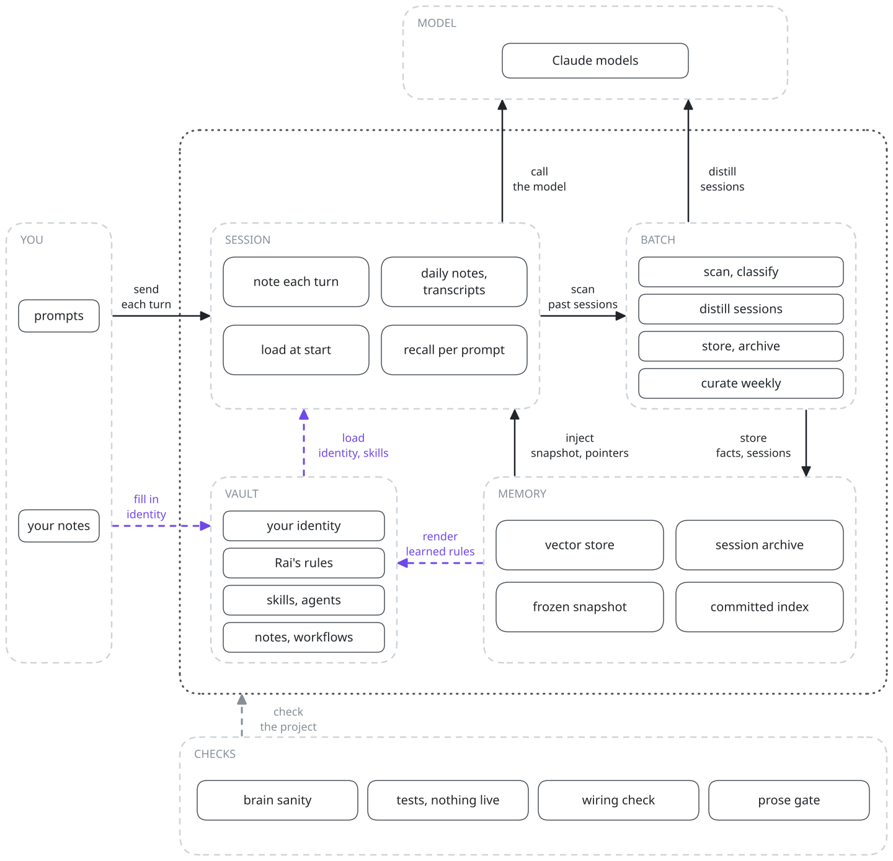
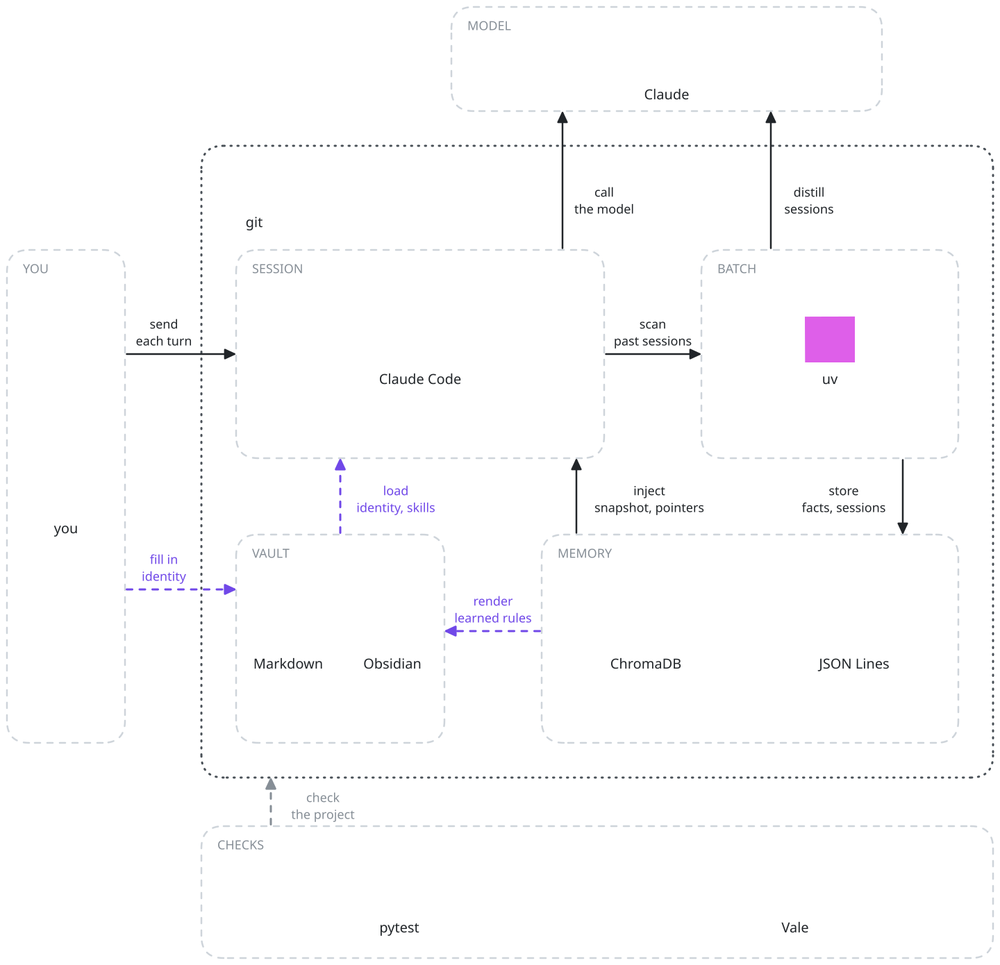

# Personal AI System

**A complete personal AI "second brain" you run inside [Claude Code](https://claude.com/claude-code).**

Personal AI System is a full, working system, not a prompt and not a wrapper. It's a Markdown
"vault" plus a brain of skills, agents, hooks, and memory that turns Claude Code into an
assistant that *knows you*: your goals, your projects, your voice, your rhythm. It remembers
across sessions, follows your rules, and helps you run your work and your life.

This repository is a **starter kit**. Everything is here and runnable; the personal layer
(`02-ana/`) ships as blank templates you fill in with your own. Clone it, make it yours, and the
assistant grows into a second brain that's actually about you.

> The assistant is named **Rai** by default. It's just a name. Rename it to whatever you like
> (see [SETUP](./SETUP.md)).



---

## The idea

Most AI assistants forget you the moment the chat ends. This system flips that. You externalize
the things that make help *good*, who you are, what you're building, how you write, what you
value, into plain Markdown files. The assistant loads them every session, works against them,
and writes back what it learns. Over time it stops being a generic chatbot and becomes *yours*.

It rests on two halves:

- **`02-ana/`, you.** Your identity, goals, projects, journal, finances, family, voice.
  Auto-loaded every session so the assistant always has context. (Private. Never published.)
- **`03-rai/`, the brain.** The machinery: 46 skills, 11 specialist agents, 11 lifecycle hooks,
  file and vector memory (Memory v3), and config.

Around them sit numbered folders for capturing ideas, doing research, taking notes, tracking
work, and running a daily news digest, a whole knowledge-and-life operating system.

---

## What's inside

```
personal-ai-system/
├── 02-ana/         YOU: identity (auto-loaded), journal, todos, finances, family, voice
├── 03-rai/         THE BRAIN: skills, agents, hooks, memory, config
│   ├── skills/       46 skills: /research, /architecture, /writing, /news-digest, /investment, …
│   ├── agents/       11 specialists: architect, engineer, debugger, reviewer, researcher, …
│   ├── hooks/        11 lifecycle hooks: identity load, memory, session/tab bookkeeping
│   ├── config/       settings.json, Vale prose styles, skill pins
│   ├── memory/       file memory (learning, state, work): starts empty, fills as you use it
│   └── semantic-memory/  vector recall (ChromaDB, Memory v3): rebuilt locally, ships empty
├── 00-landing → 13-archive   capture pipeline, inbox, projects, learning, knowledge, news, archive
└── 12-system/manual/   a one-page pointer map into the live docs above
```

The capture and idea pipelines move things from a quick note to finished work:

```
00-landing → 01-inbox → (research + rate) → knowledge / ideas / projects / learning
09-ideas:  Seed → Plant → Tree → Graduated → a real project
```

---

## What it can do

- **Know you.** Identity auto-loads so every answer is in your context, not a vacuum.
- **Build software spec-first.** `/project-init` puts a repo on a spec-driven, test-driven
  standard: a `specs/` constitution written from a real conversation, git gates that keep
  `main` behind a human merge, a proof bundle per change, and a launch review per roadmap
  item. Then `/grill` talks a feature into a spec and `/compile` builds it test-first, with an
  optional panel of outside models (`/adversarial-review`) reviewing the result.
- **Specialize on demand.** Type `/architecture`, `/research`, `/writing`, `/testing`,
  `/security`, `/devops` and more. Each routes to focused skills and expert agents.
- **Remember.** Memory v3 pairs file memory with a vector index (four ChromaDB collections) so
  it can recall past decisions and context. Live notes append to plain-text daily logs; the
  vector store is rebuilt locally. `/rai sanity` certifies the whole pipeline end to end, and
  every one of its checks has a test that proves it fires.
- **Keep a rhythm.** `/routine` runs your journal, day/week prep and a monthly mirror (Rai's
  honest look back at your month); `/life` tracks your self-model and captures wisdom;
  `/retain` rehearses what you already learned so it doesn't decay.
- **Explain visually.** `/visual` renders a plan, an explanation, a comparison, a trace or a
  step-debugger replay of a real program run as one self-contained animated HTML file.
- **Produce.** A personalized daily **news digest**, knowledge notes, idea pipelines, an
  optional investing practice, and bilingual (English and Arabic) writing support.
- **Stay safe.** Claude Code's own permission system gates every tool call; extend it with your
  own guard hook if you want a bash-pattern blocklist or a pre-commit secret scan.

Read the **[manual](./12-system/manual/README.md)** for a pointer map into the live docs, starting
with the root `AGENTS.md` and `03-rai/ARCHITECTURE.md`.

---

## Tech stack



---

## Requirements

- **[Claude Code](https://claude.com/claude-code)** (the CLI, desktop, or IDE extension).
- **Python 3** (the hooks are Python; mostly standard library).
- **[uv](https://github.com/astral-sh/uv)**, used to run the vector-memory step in an isolated env.
- **git**, to clone and to track your vault.
- A Markdown editor like **[Obsidian](https://obsidian.md)** is nice for browsing the vault, but optional.

---

## Get started

→ **[SETUP.md](./SETUP.md)** walks you from zero to your first session in a few minutes:
clone it, wire it into Claude Code, fill in the identity templates, and go.

---

## A note on the examples

`02-ana/` (who you are, your goals, family, health, money) ships as blank templates: nothing in
it is anyone's real life. The rest of the vault carries a few worked examples from a fictional
user named John (a project, a learning board, an idea, a knowledge note) so you can see the
system in motion, and the skills address the user as John. **Replace them with your own** as
you adopt the vault; the mechanics underneath are real and battle-tested.

---

## Credits

The whole thing runs on **[Claude Code](https://claude.com/claude-code)** by Anthropic, the
engine underneath it all. Thank you to the Claude Code and Anthropic team for building it.

---

## License

[MIT](./LICENSE). Use it, fork it, make it yours. If you build something good on top, sharing
it back is appreciated but not required.

*Built as a gift, so others can have a second brain too.*
